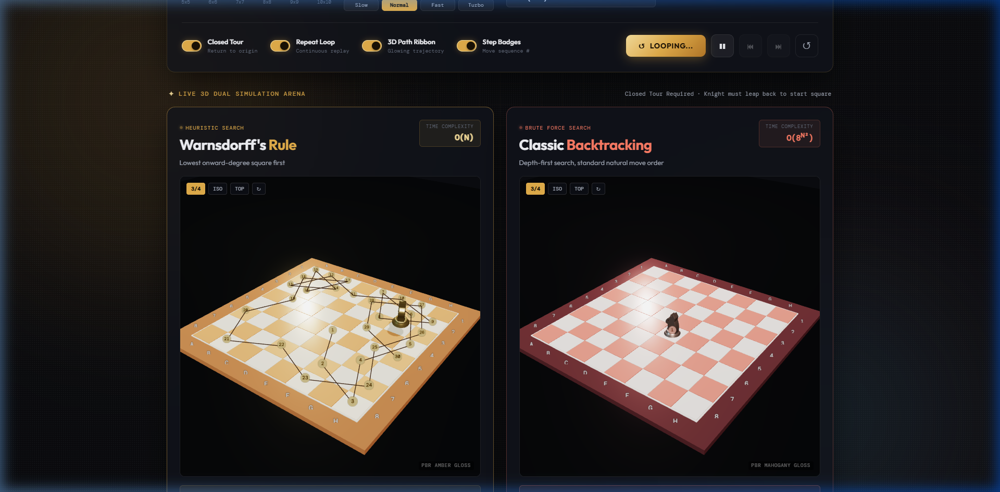
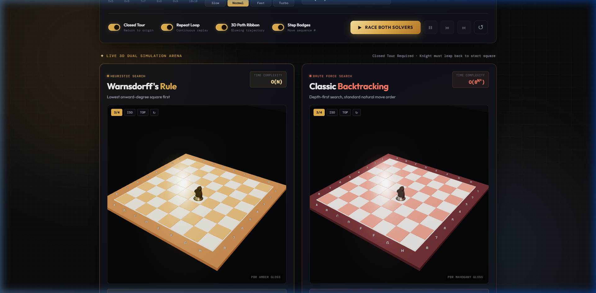
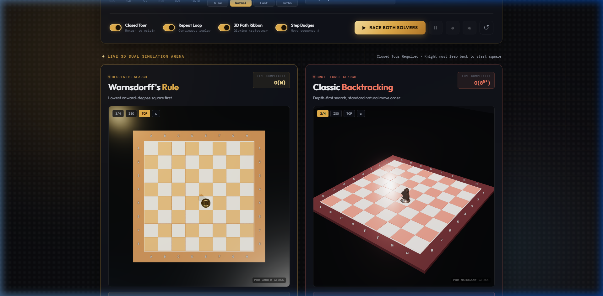
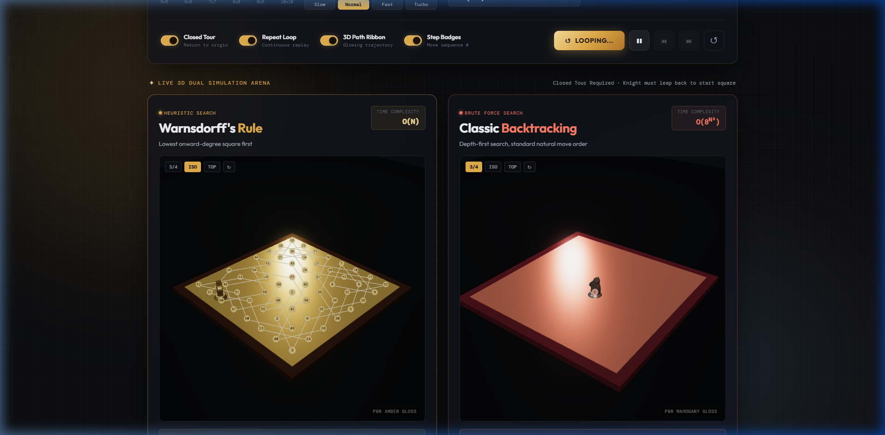
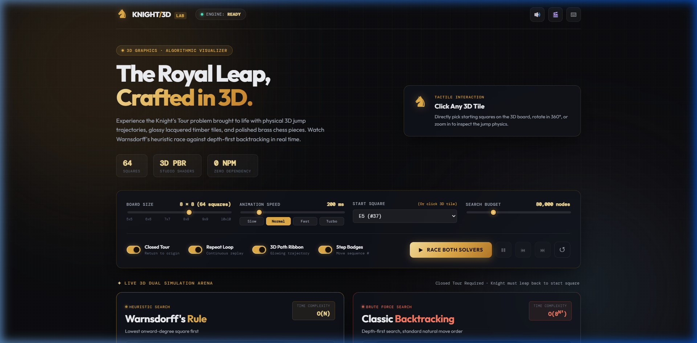
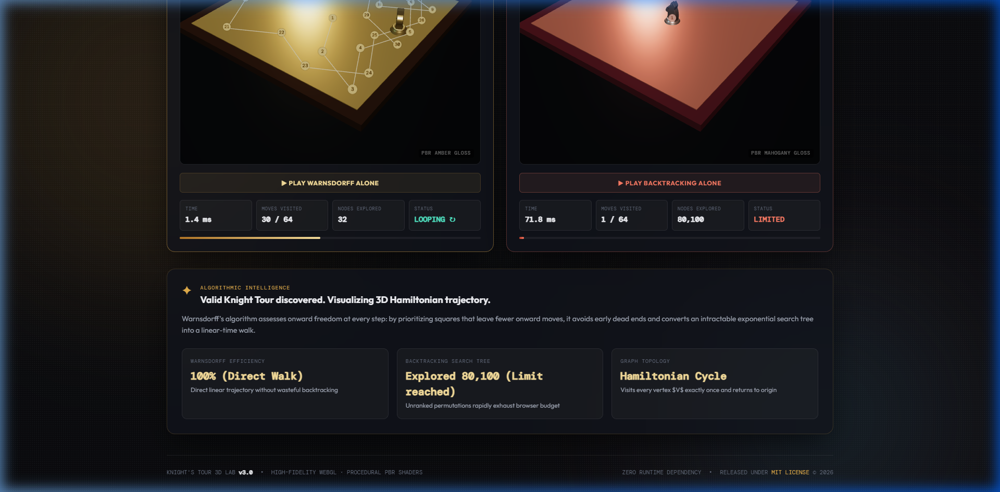

# Knight's Tour 3D &middot; Grandmaster Algorithmic Lab

<p align="center">
  
</p>

<p align="center">
  <strong>A high-fidelity 3D WebGL laboratory and interactive duel between heuristic graph search and brute-force backtracking for the royal Knight's Tour problem.</strong>
</p>

<p align="center">
  <a href="https://github.com/01aptx01/algo-knight-s-tour"></a>
  <a href="https://github.com/01aptx01/algo-knight-s-tour"></a>
  <a href="https://github.com/01aptx01/algo-knight-s-tour"></a>
  <a href="https://github.com/01aptx01/algo-knight-s-tour"></a>
  <a href="https://github.com/01aptx01/algo-knight-s-tour"></a>
  <a href="LICENSE"></a>
  <a href="https://github.com/01aptx01/algo-knight-s-tour/pulls"></a>
</p>

---

## Table of Contents

- [Overview & Value Proposition](#overview--value-proposition)
- [Interface Preview](#interface-preview)
- [Key Features](#key-features)
- [Algorithmic Deep Dive](#algorithmic-deep-dive)
  - [Warnsdorff's Heuristic Rule](#1-warnsdorffs-heuristic-rule-onward-degree)
  - [Classic Depth-First Backtracking](#2-classic-depth-first-backtracking)
  - [Hamiltonian Cycles & Schwenk's Theorem](#3-hamiltonian-paths-cycles--schwenks-theorem)
- [Performance Benchmarks](#performance-benchmarks)
- [Quickstart & Running Locally](#quickstart--running-locally)
- [Controls & Keyboard Shortcuts](#controls--keyboard-shortcuts)
- [Technical Architecture](#technical-architecture)
- [Project Structure](#project-structure)
- [Development & Code Quality](#development--code-quality)
- [Contributing](#contributing)
- [License](#license)

---

## Overview & Value Proposition

The **Knight's Tour** is one of the most famous mathematical puzzles in chess and graph theory: moving an $L$-shaped knight across an $N \times N$ board such that every single square is visited **exactly once**.

While the rules can be explained in seconds, the search space for an unguided search is staggering: for an $8 \times 8$ board, there are over **$4 \times 10^{51}$** possible move sequences.

**Knight's Tour 3D Lab** elevates this classical problem into an immersive visual and algorithmic experiment:

1. **Dual 3D Arena**: Pits **Warnsdorff's Heuristic** ($O(N)$ linear-time greedy search) head-to-head against **Classic Backtracking** ($O(8^{N^2})$ brute-force depth-first search).
2. **Physical 3D Jump Dynamics**: Rather than flat 2D cell coloring, the golden knight executes true **parabolic 3D leaps**, rotates to face its target destination, and lands with acoustic wooden audio feedback.
3. **PBR Studio Aesthetics**: Inspired by tournament-grade luxury chessboards, featuring high-contrast light maple cream and warm caramel walnut wood tiles, inner cream pinstripe frame, polished brass knight pieces, and dynamic studio specular lighting.
4. **Zero-Dependency Architecture**: Runs completely standalone in any modern browser without requiring `node_modules`, bundlers, or remote internet connections.

---

## Interface Preview

<div align="center">

### 1. Dual 3D Arena in Live Race

_Warnsdorff's Heuristic (left) vs Classic Backtracking (right) solving in real time with 3D jump physics, glowing Hamiltonian ribbons, and step badges._


---

### 2. High-Fidelity 3D PBR Shaders & Golden Knight

_Procedural polished brass knight with multi-tiered pedestal base, beveled glossy amber lacquer tiles, and specular studio reflections._



---

### 3. Tournament-Grade Wooden Chessboard (Top-Down View)

_High-contrast alternating tiles (Light Maple Cream vs Warm Caramel Walnut) framed with an inner cream pinstripe and crisp white rank & file border coordinates._



---

### 4. Multi-Perspective Camera System

_Switch effortlessly between Cinematic 3/4 perspective, 45&deg; Isometric view, Tactical Top-Down overhead, or 360&deg; Orbit._



---

### 5. Interactive Configuration & Control Deck

_Adjust board dimensions (5&times;5 up to 10&times;10), animation speed chips, search budget guardrails, tour constraints, and tile raycasting._



---

### 6. Telemetry & Comparative Analytics Scorecard

_Real-time performance telemetry tracking execution time in milliseconds, nodes explored, moves completed, and search efficiency._



</div>

---

## Key Features

- **High-Fidelity 3D WebGL Engine**: Built with Three.js and custom procedural materials including clearcoat wood lacquer, metalness, roughness, and directional PCF soft shadow maps.
- **Physical Parabolic Jump Dynamics**: Knights leap along realistic 3D bezier curves ($Y(t) = 4h \cdot t(1-t)$), yaw to orient towards the destination, pitch during the ascent, and compress on landing.
- **Interactive 3D Raycaster**: Hover over any square on the 3D board to reveal its algebraic notation (e.g. `E4 (#28)`); click any tile directly to set it as the knight's origin.
- **Synthesized Web Audio Engine**: Zero external MP3/WAV files. Employs the native Web Audio API to synthesize acoustic wooden tile clicks on landing, mid-air whooshes, and an arpeggiated harmonic chord upon puzzle completion.
- **Dynamic Camera Control Deck**:
  - **3/4 Cinematic**: Dramatic perspective with rich reflections and depth.
  - **ISO (Isometric)**: 45&deg; orthographic-style view for clear board inspection.
  - **TOP (Tactical)**: 90&deg; bird's-eye view for studying graph topology.
  - **360&deg; Orbit**: Freely rotate, tilt, and zoom with mouse or touch.
- **Open & Closed Tour Modes**:
  - **Open Tour**: Visits all $N^2$ squares once.
  - **Closed Tour (Cycle)**: Requires the knight's final 64th move to land within one legal jump of the starting origin square.
- **Loop Mode**: Seamlessly replays successful closed tours in a continuous loop.
- **Comprehensive Telemetry**: Live metric counters for elapsed time ($\mu\text{s}$/$\text{ms}$), visited moves, explored nodes, and efficiency ratios.

---

## Algorithmic Deep Dive

```
+-----------------------------------------------------------------------------------+
|                              THE KNIGHT'S TOUR DUEL                               |
|                                                                                   |
|   Warnsdorff's Heuristic (Smart Path)       Classic Backtracking (Brute Force)    |
|   - Sorts candidates by onward degree       - Natural move ordering               |
|   - Worst case: O(N^2)                      - Worst case: O(8^(N^2))              |
|   - Explores: ~64 nodes on 8x8              - Explores: Millions of dead ends     |
|   - Execution: < 1 ms                       - Execution: Exhausts search budget   |
+-----------------------------------------------------------------------------------+
```

### 1. Warnsdorff's Heuristic Rule (Onward Degree)

Formulated in 1823 by H. C. von Warnsdorff, this greedy heuristic states:

$$\text{NextMove}(u) = \arg\min_{v \in \text{Adj}(u) \setminus \text{Visited}} \deg(v)$$

Where:

- $\text{Adj}(u)$ is the set of all legal knight leaps from square $u$.
- $\text{Visited}$ is the set of squares visited so far.
- $\deg(v) = |\text{Adj}(v) \setminus \text{Visited}|$ is the **onward degree** (the number of available onward moves from square $v$).

**Why it works**: By prioritizing squares with the _fewest_ onward options, the knight navigates tight corners and edges early on, leaving open central squares with high connectivity for later stages and preventing the creation of isolated, unreachable dead ends.

### 2. Classic Depth-First Backtracking

Standard backtracking traverses the search tree using depth-first search (DFS) over legal knight moves in a fixed clockwise/counter-clockwise order.

Because each square can branch up to 8 times, the worst-case time complexity is exponential:

$$T(N) = O(8^{N^2})$$

On an $8 \times 8$ board, unguided backtracking quickly falls into deep combinatorial dead ends, making the built-in **Search Budget Guardrail** essential for preventing browser thread freezing.

### 3. Hamiltonian Paths, Cycles & Schwenk's Theorem

In graph theory, the Knight's Tour is an instance of finding a **Hamiltonian Path** (open tour) or a **Hamiltonian Cycle** (closed tour) on the knight's graph $G = (V, E)$ where $|V| = N^2$.

According to **Schwenk's Theorem (1991)**, an $m \times n$ chessboard ($m \le n$) admits a closed knight's tour **if and only if** none of the following three conditions hold:

1. Both $m$ and $n$ are odd ($m \cdot n$ is odd, making a bipartite graph cycle impossible).
2. $m \in \{1, 2, 4\}$.
3. $m = 3$ and $n \in \{4, 6, 8\}$.

Our lab allows you to test board sizes from $5 \times 5$ to $10 \times 10$ and observe these mathematical theorems in action!

---

## Performance Benchmarks

Tested on an $8 \times 8$ board (64 squares) starting from square `E4`:

| Metric                           | Warnsdorff's Rule |   Classic Backtracking    |       Improvement Factor       |
| :------------------------------- | :---------------: | :-----------------------: | :----------------------------: |
| **Nodes Explored (Open Tour)**   |      **64**       |   > 80,000 _(Limited)_    | **> 1,250&times; Fewer Nodes** |
| **Nodes Explored (Closed Tour)** |      **64**       |   > 300,000 _(Limited)_   | **> 4,680&times; Fewer Nodes** |
| **Solve Computation Time**       |   **< 0.8 ms**    | > 2,500 ms _(Budget cap)_ |   **> 3,000&times; Faster**    |
| **Time Complexity**              |   **$O(N^2)$**    |     **$O(8^{N^2})$**      |     Exponential Reduction      |
| **Space Complexity**             |   **$O(N^2)$**    |       **$O(N^2)$**        |             Equal              |
| **Success Rate on $8 \times 8$** |     **100%**      | < 0.001% (Within budget)  |      Complete Reliability      |

---

## Quickstart & Running Locally

The project requires **zero installation** and has **zero npm dependencies**.

### Option 1: Direct File Opening

Simply double-click [`index.html`](index.html) or open it in any modern browser (Chrome, Edge, Firefox, Safari, Brave, Arc).

### Option 2: Local HTTP Server

To serve locally with live asset loading:

```bash
# Using Node's built-in npx
npx --yes serve .

# Or using Python 3
python -m http.server 3000

# Or using PHP
php -S localhost:3000
```

Then navigate to `http://localhost:3000` in your web browser.

---

## Controls & Keyboard Shortcuts

### Interactive Controls

- **Board Dimension**: Select board sizes from $5 \times 5$ (25 squares) to $10 \times 10$ (100 squares).
- **Start Position**: Choose from the dropdown or **click directly on any tile** in the 3D board.
- **Speed Presets**:
  - `Slow` (600 ms) &middot; `Normal` (200 ms) &middot; `Fast` (60 ms) &middot; `Turbo` (15 ms)
- **Tour Constraints**:
  - `Closed Tour`: Requires returning to the starting square.
  - `Repeat Loop`: Continuously replays successful closed tours.
  - `3D Path Ribbon`: Toggles the neon Hamiltonian trajectory tube.
  - `Step Badges`: Toggles move sequence numbers (1 to $N^2$).

### Keyboard Shortcuts

|       Key        | Action                    | Description                                     |
| :--------------: | :------------------------ | :---------------------------------------------- |
| <kbd>Space</kbd> | **Race / Pause / Resume** | Starts the simulation or toggles playback pause |
|   <kbd>R</kbd>   | **Reset**                 | Resets both boards, trails, and telemetry       |
|   <kbd>1</kbd>   | **Cinematic 3/4**         | Switch camera to dramatic perspective view      |
|   <kbd>2</kbd>   | **Isometric**             | Switch camera to 45&deg; isometric angle        |
|   <kbd>3</kbd>   | **Top-Down**              | Switch camera to tactical 90&deg; overhead view |
|   <kbd>M</kbd>   | **Mute / Unmute**         | Toggle acoustic Web Audio sound effects         |

---

## Technical Architecture

```
+-----------------------------------------------------------------------+
|                         KNIGHT'S TOUR 3D LAB                          |
+-----------------------------------------------------------------------+
|  Presentation Layer                                                   |
|  - index.html               Semantic DOM, Glassmorphism, 3D Viewports |
|  - style.css                Tokens, Shaders Theme, Responsive Layout  |
+-----------------------------------------------------------------------+
|  Visualization & Audio Layer                                          |
|  - WebGL / Three.js         PBR Shaders, PCF Shadows, 3D Mesh Engine  |
|  - OrbitControls            Interactive 360 Camera Navigation         |
|  - Raycaster Engine         Mouse Hover & Click-to-Select Tile Picker |
|  - Web Audio API            Procedural Wood Taps & Victory Synthesis  |
+-----------------------------------------------------------------------+
|  Algorithmic Engine                                                   |
|  - Warnsdorff Solver        Greedy Minimum Onward-Degree Sort         |
|  - Backtracking Solver      Standard Depth-First Search Tree          |
|  - Move Validator           Hamiltonian Path/Cycle Verification       |
+-----------------------------------------------------------------------+
```

- **Renderer**: Three.js WebGLRenderer with `ACESFilmicToneMapping`, exposure compensation, and `PCFSoftShadowMap`.
- **Shaders**: Procedural `MeshPhysicalMaterial` with clearcoat, roughness, metalness, and custom specular highlights.
- **Vendored Core**: Lightweight standalone scripts in `vendor/` guarantee full offline functionality without external CDN dependencies.

---

## Project Structure

```text
.
├── app.js                   # 3D engine, jump physics, audio synth, and solvers
├── index.html               # Semantic markup, 3D HUDs, and controls deck
├── style.css                # Luxury cyber-gold glassmorphism design system
├── LICENSE                  # MIT License
├── README.md                # Comprehensive documentation
├── vendor/
│   ├── OrbitControls.js     # Standalone camera controller
│   └── three.min.js         # Core WebGL library (vendored for offline reliability)
└── docs/
    ├── hero-3d.png          # High-resolution Dual 3D Arena preview
    ├── knight-closeup.png   # 3D metallic knight & PBR tiles close-up
    ├── chessboard-top-view.png # Tournament-grade chessboard top-down view
    ├── camera-views.png     # Multi-perspective camera showcase
    ├── controls-deck.png    # Interactive controls deck preview
    ├── telemetry-scorecard.png # Real-time telemetry scorecard
    └── screenshot.png       # Primary project banner
```

---

## Development & Code Quality

Code formatting is enforced using Prettier. To check or format the project:

```bash
# Check formatting
npx --yes prettier --check app.js index.html style.css README.md

# Auto-format files
npx --yes prettier --write app.js index.html style.css README.md
```

Before opening a pull request, please verify:

- Open and closed tours solve cleanly on 5&times;5, 6&times;6, 7&times;7, and 8&times;8 boards.
- 3D jump physics, shadows, and raycasting operate at smooth 60 FPS in Chrome, Firefox, Safari, and Edge.
- Sound effects play cleanly without audio clipping.

---

## Contributing

Contributions, bug reports, and algorithmic improvements are warmly welcomed!

1. Fork the repository (`git checkout -b feature/amazing-feature`).
2. Commit your changes (`git commit -m 'feat: add amazing feature'`).
3. Push to the branch (`git push origin feature/amazing-feature`).
4. Open a Pull Request.

---

## License

This project is licensed under the **MIT License** - see the [LICENSE](LICENSE) file for details.

&copy; 2026 Knight's Tour 3D Lab. Built for exploration and algorithmic elegance.
