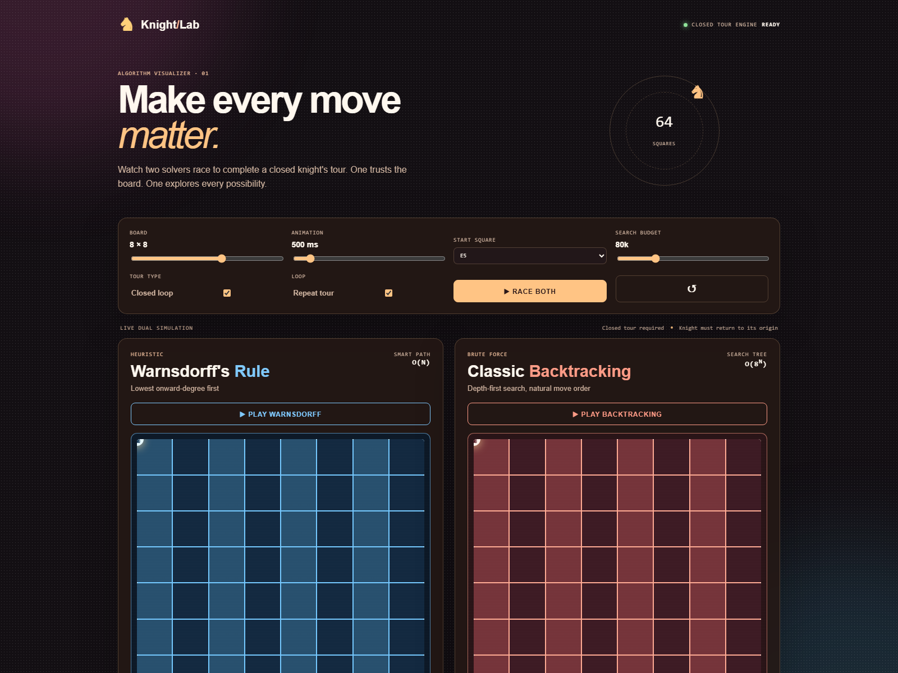

# Knight's Tour Lab

<p align="center">
  
</p>

<p align="center">
  An interactive visual lab for seeing heuristic search beat brute force at the Knight's Tour problem.
</p>

<p align="center">
  
  
  
</p>

## Why this exists

The Knight's Tour is a simple rule with a surprisingly large search space: move a knight so that every square is visited exactly once. Knight's Tour Lab makes the algorithmic trade-off visible by running two solvers side by side:

- **Warnsdorff's heuristic** prioritizes the square with the fewest onward moves.
- **Classic backtracking** follows legal moves in their natural order.

Tune the board, start square, animation speed, tour type, and search budget. Then watch the path, explored nodes, timing, and result unfold in real time.

## Highlights

- Live dual simulation with independent boards and metrics
- Open tours and closed tours that return to the origin
- Configurable 5x5–10x10 boards and starting squares
- Search-budget guardrail for safe, responsive browser demos
- Loop mode for replaying successful closed tours
- Responsive, accessible interface with no build step or runtime dependency

## Run it locally

No installation is required. Open [`index.html`](index.html) directly in a modern browser, or serve the directory locally:

```sh
npx --yes serve .
```

Then open the local URL printed by the server. The project is also ready for static hosting on GitHub Pages, Netlify, Vercel, or any equivalent provider.

## How the algorithms work

Both solvers use depth-first search over legal knight moves. A result is valid only when it:

1. Visits every square exactly once.
2. Uses a legal knight move between consecutive squares.
3. Returns to the starting square when closed-tour mode is enabled.

Warnsdorff's solver sorts each candidate by its onward degree — the number of unvisited squares available after moving there. This typically reduces branching, but it remains heuristic-guided backtracking and can still consume the configured search budget. The classic solver keeps the generated move order, exposing how quickly an unranked search tree grows.

The budget is a practical browser safeguard, not a formal complexity bound. Increase it when a solver reports `LIMITED`.

## Project structure

```text
.
├── app.js            # Solver logic, simulation state, rendering, and controls
├── index.html        # Semantic page structure and accessible controls
├── style.css         # Visual design, responsive layout, and animations
├── docs/screenshot.png # Browser screenshot used in the README
├── LICENSE           # MIT license
└── README.md
```

## Development

The project intentionally stays dependency-free. If you have Node.js installed, use the included Prettier configuration:

```sh
npx --yes prettier --check app.js index.html style.css README.md
npx --yes prettier --write app.js index.html style.css README.md
```

Before opening a pull request, test open and closed tours, multiple board sizes, reset, loop mode, and the search-budget limit in a current version of Chrome, Edge, Firefox, or Safari.

## Contributing

Bug reports, algorithm experiments, accessibility improvements, and visual refinements are welcome. Keep changes focused, preserve the dependency-free setup, and explain the user-visible effect in the pull request description.

## License

Released under the [MIT License](LICENSE). You are free to use, modify, and distribute the project with attribution.
